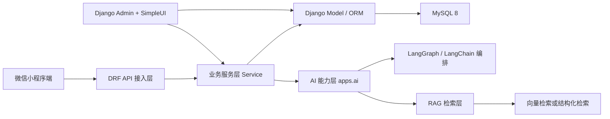

# 英语单词微信小程序后端架构文档

## 1. 文档说明

- 项目名称：英语单词微信小程序
- 文档名称：项目后端架构文档
- 文档版本：V1.1
- 编写日期：2026-04-28
- 适用范围：后端 API、后台管理、数据库设计、部署设计

## 2. 架构目标

本项目后端需要满足以下目标：

- 为微信小程序提供稳定、清晰、可扩展的 RESTful API。
- 支持用户登录、词书管理、学习计划、学习记录、复习、测试、收藏、错词本、统计等核心业务。
- 支持运营人员通过 Django Admin 进行词书、单词、例句、学习数据等后台维护。
- 保证首版 MVP 能够快速落地，同时为后续管理后台增强、会员体系、AI 助学等功能预留扩展空间。
- 为 AI 助学提供独立能力层，支持后续接入 LangChain、LangGraph、RAG、MCP 和 AI 观测评测能力。

## 3. 技术选型

### 3.1 首版必选技术

- 开发语言：Python
- Web 框架：Django
- API 框架：Django REST Framework
- 数据库：MySQL 8.0
- ORM：Django ORM
- 后台管理：Django Admin
- Admin 美化：SimpleUI
- 数据交换格式：JSON
- 接口协议：HTTPS

### 3.2 建议补充技术

- 环境变量管理：`python-dotenv` 或等价方案
- 接口鉴权：JWT 或基于 Token 的登录态方案
- 静态文件服务：Nginx
- WSGI/ASGI 运行：Gunicorn 或等价方案
- 日志管理：Django logging + 文件日志

### 3.3 可扩展技术预留

- Redis：缓存、热点数据加速、会话辅助、限流扩展
- Celery：异步任务，例如学习日报、批量统计、延迟任务
- 对象存储：用于音频文件、图片资源、导入导出文件
- LangChain：模型适配、Tool 封装、结构化输出
- LangGraph：状态化 AI 教学工作流与多步骤编排
- 向量数据库：Qdrant / FAISS / Chroma，用于 RAG 检索
- MCP：统一 AI Tools / Resources / Prompts 的标准化接口
- LangSmith 或等价平台：AI tracing、评测、提示词版本管理

说明：

- MVP 首版不强制落地 Redis 和 Celery，但架构设计需预留接入位置。
- 后端主链路必须基于 `Python + Django + MySQL 8 + Django Admin + SimpleUI` 实现。

## 4. 总体架构设计

后端采用“接入层 + 业务层 + 数据层 + 管理层”的分层设计。



### 4.1 分层说明

- API 接入层：负责请求接收、参数校验、权限校验、响应封装。
- 业务服务层：负责核心业务流程编排，例如登录、生成学习任务、提交复习结果、更新掌握度。
- 数据模型层：负责模型定义、关系维护、索引设计、事务边界。
- 管理层：负责后台管理、词书维护、单词维护、学习数据查询与运营辅助。
- AI 能力层：负责模型调用、检索增强、工作流编排、工具层、会话记录与 AI 运行时观测。

### 4.2 设计原则

- 模块边界清晰，以 Django app 拆分业务领域。
- 业务逻辑尽量沉淀到 service 层，避免过多堆积在 view 和 admin 中。
- 数据结构稳定优先，接口统一优先，便于小程序端长期联调。
- 管理后台复用 Django Admin，降低首版后台开发成本。

## 5. 后端模块划分

建议按业务域拆分 Django app。

### 5.1 模块清单

| 模块 | Django app | 主要职责 |
| --- | --- | --- |
| 用户与登录 | `apps.users` | 微信登录、用户档案、用户设置、登录态、意见反馈 |
| 词书与单词 | `apps.books` | 词书管理、单词管理、词书分类、词书查询 |
| 学习计划 | `apps.plans` | 当前计划、每日目标、暂停/恢复、切换词书、计划状态、用户目标同步 |
| 学习记录 | `apps.learn` | 新词学习、学习记录、掌握状态更新 |
| 复习系统 | `apps.review` | 复习任务生成、复习题型、复习结果提交 |
| 测试系统 | `apps.exams` | 小测验、测试题生成、测试结果保存 |
| 语法学习 | `apps.grammar` | 语法点管理、句子拆解、颜色标注、语法练习、学习进度 |
| 统计与打卡 | `apps.stats` | 首页统计、趋势数据、打卡、学习汇总 |
| 系统配置 | `apps.system` | 枚举配置、字典项、语音合成、基础配置预留 |
| AI 助学 | `apps.ai` | AI 讲词、AI 学习教练、AI 错词复盘、语法问答、写作批改、翻译训练、学习报告、会话反馈、结构化 RAG、内部 MCP 工具调用 |
| 运营后台 | `apps.ops` | Admin 菜单组织、运营查询、导入导出扩展 |

### 5.2 模块依赖关系

- `users` 为基础模块，其它业务模块均依赖用户身份。
- `books` 为内容基础模块，`plans`、`learn`、`review`、`exams` 都依赖词书与单词。
- `grammar` 为专项内容模块，依赖 `users` 记录学习进度，必要时可复用 `books` 中的单词信息做词汇联动。
- `plans` 提供用户当前学习上下文。
- `learn`、`review`、`exams` 共同写入学习轨迹与掌握度。
- `grammar` 写入句子浏览、练习结果和语法点掌握轨迹，并可被 `stats` 聚合。
- `stats` 聚合多个业务模块的数据输出统计结果。
- `ai` 读取 `books`、`plans`、`learn`、`review`、`grammar`、`stats` 等上下文，统一向小程序输出 AI 讲解、教练建议和 Agent 工具调用结果。

## 6. API 架构设计

## 6.1 API 版本与风格

- 接口前缀：`/api/v1`
- 风格：RESTful
- 返回格式：统一 JSON 响应

统一响应建议：

```json
{
  "code": 0,
  "message": "ok",
  "data": {}
}
```

### 6.2 API 层建议结构

- `views.py`：处理 HTTP 请求入口
- `serializers.py`：请求和响应数据校验
- `services.py`：承载业务编排逻辑
- `models.py`：数据模型
- `urls.py`：模块路由
- `admin.py`：后台管理配置

### 6.3 API 模块边界建议

- `users`：`/auth/*`、`/users/*`
- `books`：`/books/*`
- `plans`：`/plans/*`
- `learn`：`/learn/*`
- `review`：`/review/*`
- `exams`：`/tests/*`
- `grammar`：`/grammar/*`
- `stats`：`/stats/*`、`/checkin/*`

### 6.4 鉴权设计

推荐方案：

- 小程序通过微信登录接口换取服务端登录态。
- 服务端校验 `code`，根据 `openid/unionid` 获取或创建用户。
- 登录成功后签发 Token 或 JWT。
- 小程序后续请求通过请求头携带登录态。
- 开发调试模式下，建议使用固定测试账号标识登录。前端会将该标识转换为固定 `debug_xxx` code，后端再映射成稳定的 `mock_debug_xxx` openid，便于在清空模拟器缓存后继续复用同一测试用户的数据。

权限控制建议：

- 公开接口：词书基础浏览、部分样词预览
- 登录接口：微信登录、用户资料同步
- 私有接口：学习计划、学习记录、复习结果、测试成绩、语法学习记录、收藏、错词本、统计、意见反馈

## 7. 业务处理架构

### 7.1 核心链路一：登录链路

1. 小程序调用微信登录获取 `code`
2. 小程序调用 `/api/v1/auth/wx-login`
3. 后端请求微信接口换取 `openid/unionid`
4. 后端创建或查询用户
5. 后端返回 Token、用户基础信息、当前计划状态

### 7.2 核心链路二：学习链路

1. 用户进入首页请求今日任务
2. 后端根据当前计划生成今日新词列表和复习列表
3. 用户学习单词并提交学习记录
4. 后端更新 `learning_records` 和 `word_progress`
5. 首页和统计页读取最新汇总结果

计划管理补充规则：

- `/plans/current` 优先返回 active 计划；没有 active 计划时返回最近 paused 计划，便于小程序展示和恢复。
- 更新计划每日目标时，同步写入 `users.UserSetting.daily_target`。
- 切换词书时支持保留旧计划完成数量或重新开始，并保证同一时间只有一个 active 主计划。

### 7.3 核心链路三：复习链路

1. 后端根据学习记录和掌握度生成待复习列表
2. 用户完成复习题目
3. 后端记录答题结果，并生成基于规则的即时答题反馈，包含正确答案、错因说明和恢复建议
4. 更新掌握度、错词本、下次复习时间

### 7.4 核心链路四：语法学习链路

1. 用户进入语法首页，先选择“自动拆句”“例句学语法”或“语法总览”
2. 当用户进入例句学习页时，小程序请求语法主题列表、句子列表、推荐句子和学习进度
3. 当用户进入自动拆句页并输入句子时，小程序调用 `/api/v1/grammar/analyze`
4. 后端返回句子原文、中文翻译、语法点、颜色标注、分块拆解信息
5. 用户点击句子片段、切换主干视图或完成语法练习
6. 后端写入 `grammar_learning_records`，更新主题掌握度与最近学习记录
7. 统计模块聚合语法学习次数、练习正确率、掌握分布

### 7.5 核心链路五：Admin 运维链路

1. 运营通过 Django Admin 登录后台
2. 通过 SimpleUI 菜单进入词书、单词、例句、语法点、语法句子等管理页面
3. 执行增删改查、批量导入、状态维护
4. 查看用户学习统计、错误单词趋势、活跃用户概览

## 8. 数据库架构设计

## 8.1 数据库规范

- 数据库版本：MySQL 8.0
- 存储引擎：InnoDB
- 字符集：`utf8mb4`
- 建议排序规则：兼顾中英文检索场景
- 所有业务表统一包含创建时间、更新时间字段

## 8.2 核心数据表

建议首版至少包含以下核心表：

| 表名 | 说明 |
| --- | --- |
| `users` | 用户基础信息 |
| `user_settings` | 用户学习设置，包括每日目标、提醒、自动播放、全局发音语速、主题等 |
| `user_feedback` | 用户意见反馈，管理员后台查看与处理 |
| `books` | 词书信息 |
| `words` | 单词信息 |
| `word_examples` | 单词例句、扩展信息 |
| `user_plans` | 用户学习计划 |
| `daily_tasks` | 每日任务汇总 |
| `learning_records` | 学习行为记录 |
| `review_records` | 复习答题记录，包含 `answer_feedback` 即时讲解数据 |
| `test_records` | 测试结果记录 |
| `test_questions` | 测试题目明细 |
| `grammar_points` | 语法点定义 |
| `grammar_sentences` | 语法学习句子 |
| `grammar_annotations` | 句子片段标注与解释 |
| `grammar_learning_records` | 语法学习行为与练习记录 |
| `ai_conversations` | AI 会话，覆盖讲词、RAG、写作、情景对话等场景 |
| `ai_messages` | AI 会话消息，记录用户输入、AI 回复、提示词版本和结构化 payload |
| `ai_study_reports` | AI 周报/月报摘要与学习快照 |
| `ai_user_feedback` | AI 回答帮助度、纠错反馈与扩展数据 |
| `ai_user_profile_memory` | AI 用户长期记忆与画像摘要 |
| `ai_evaluation_cases` | AI 评测用例定义 |
| `ai_evaluation_runs` | AI 评测运行记录、回放与结果快照 |
| `ai_run_logs` | AI 接口运行日志，记录功能类型、缓存命中、耗时、请求/响应和错误 |
| `ai_response_cache` | AI 响应缓存，按功能与请求哈希缓存可复用结果 |
| `word_progress` | 用户单词掌握状态 |
| `favorites` | 收藏词 |
| `wrong_words` | 错词本 |
| `checkin_records` | 打卡记录 |

## 8.3 关键关系说明

- `users` 1 对多 `user_plans`
- `books` 1 对多 `words`
- `grammar_points` 1 对多 `grammar_sentences`
- `grammar_sentences` 1 对多 `grammar_annotations`
- `users` 与 `words` 通过 `word_progress` 关联
- `users` 与 `words` 通过 `favorites`、`wrong_words` 关联
- `users` 1 对多 `learning_records`、`review_records`、`test_records`、`grammar_learning_records`

## 8.4 索引建议

高频索引建议：

- `users.openid`
- `users.unionid`
- `user_plans.user_id`
- `words.book_id`
- `learning_records.user_id`
- `learning_records.word_id`
- `grammar_sentences.point_id`
- `grammar_annotations.sentence_id + sort_order`
- `grammar_learning_records.user_id + sentence_id`
- `grammar_learning_records.user_id + point_id`
- `word_progress.user_id + word_id`
- `word_progress.review_due_at`
- `wrong_words.user_id + word_id`
- `checkin_records.user_id + checkin_date`

## 8.5 事务设计建议

以下业务场景建议使用事务：

- 创建学习计划并初始化首日任务
- 提交复习结果并同时更新掌握度、错词本、复习时间
- 测试交卷并写入测试记录、题目结果、统计汇总
- 提交语法练习结果并同时更新语法掌握度、最近学习记录

## 9. Django Admin 与 SimpleUI 架构

## 9.1 设计原则

- 首版后台不单独开发 Web 管理端页面
- 直接采用 Django Admin 作为后台基础能力
- 使用 SimpleUI 进行后台界面美化和菜单分组

## 9.2 Admin 管理范围

后台建议管理以下对象：

- 用户
- 意见反馈
- 词书
- 单词
- 单词例句
- 语法点
- 语法句子
- 句子语法标注
- 学习计划
- 学习记录
- 复习记录
- 测试记录
- 错词本
- 收藏夹
- 打卡记录

## 9.3 Admin 菜单建议

SimpleUI 菜单建议按以下方式组织：

- 用户中心
- 内容中心
- 语法内容
- 学习计划
- 学习与复习
- 测试与成绩
- 统计与打卡
- 系统配置

## 9.4 Admin 扩展建议

- 配置列表过滤器、搜索字段、只读字段
- 支持词书和单词批量导入
- 支持重要统计数据快捷入口
- 支持操作日志留痕

## 10. 配置与环境设计

建议将配置拆分为多环境 settings。

### 10.1 建议的 settings 结构

- `config/settings/base.py`
- `config/settings/dev.py`
- `config/settings/test.py`
- `config/settings/prod.py`

### 10.2 环境变量建议

- `DJANGO_SETTINGS_MODULE`
- `SECRET_KEY`
- `DEBUG`
- `ALLOWED_HOSTS`
- `MYSQL_HOST`
- `MYSQL_PORT`
- `MYSQL_DB`
- `MYSQL_USER`
- `MYSQL_PASSWORD`
- `JWT_SECRET` 或等价鉴权密钥

### 10.3 静态与媒体资源

- `static/`：Django 静态文件
- `media/`：上传文件、音频资源、导入模板
- `logs/`：业务日志、错误日志、访问日志

## 11. 部署架构建议

生产环境推荐部署方式：

```text
微信小程序
   ↓ HTTPS
Nginx
   ↓
Gunicorn + Django
   ↓
MySQL 8
```

### 11.1 部署要点

- Nginx 负责 HTTPS、反向代理、静态文件分发
- Django 负责 API 和 Admin 服务
- MySQL 8 负责核心业务数据存储
- 日志独立保存，便于问题排查

### 11.2 安全要求

- 强制使用 HTTPS
- 后端校验所有用户身份
- Token 设置有效期与刷新机制
- Admin 强制高强度密码和权限分级
- 数据库账号最小权限化

## 12. 后端目录结构设计

说明：

- 以下为建议目录结构，当前项目已创建目录骨架。
- 具体 Python 文件将在开发阶段按本结构继续补齐。

```text
backend/
├─ config/
│  └─ settings/
├─ apps/
│  ├─ users/
│  ├─ books/
│  ├─ plans/
│  ├─ learn/
│  ├─ review/
│  ├─ exams/
│  ├─ grammar/
│  ├─ stats/
│  ├─ system/
│  └─ ops/
├─ common/
│  ├─ core/
│  ├─ utils/
│  ├─ middlewares/
│  ├─ permissions/
│  └─ responses/
├─ templates/
│  └─ admin/
├─ static/
├─ media/
├─ logs/
├─ scripts/
├─ deploy/
└─ tests/
```

## 13. 目录职责说明

### 13.1 `config`

- Django 项目级配置
- 路由入口
- WSGI / ASGI 配置
- 多环境 settings

### 13.2 `apps`

- 每个子目录为一个独立业务域
- 包含 `models.py`、`views.py`、`serializers.py`、`services.py`、`admin.py`、`urls.py`

### 13.3 `common`

- 放通用能力
- 例如统一响应、公共异常、权限类、中间件、工具函数

### 13.4 `templates/admin`

- Django Admin 和 SimpleUI 的模板扩展
- 管理后台首页增强、菜单扩展、品牌样式定制

### 13.5 `scripts`

- 导入词书、导入单词、导入语法句库、初始化数据、批量修复等脚本

### 13.6 `deploy`

- 部署脚本、环境模板、Nginx/Gunicorn 配置示例

## 14. 开发规范建议

- 一个业务模块一个 Django app
- API 返回结构保持统一
- 复杂业务逻辑放入 service 层
- 查询优化优先使用 ORM 的 `select_related`、`prefetch_related`
- 重要接口补齐单元测试和接口测试
- 管理后台字段命名与 API 字段尽量一致

## 15. 首版实施建议

P0 优先开发顺序：

1. `users`
2. `books`
3. `plans`
4. `learn`
5. `review`
6. `stats`
7. `ops` 中的 Admin 能力

当前 P0 补齐状态：

- `books` 已支持词书列表、关键词、分类和难度层级筛选。
- `plans` 已支持创建、更新每日目标、暂停/恢复、切换词书、保留/重置进度和用户设置同步。
- `users` 已支持学习设置、全局发音语速和意见反馈，管理员可在 Django Admin 查看与处理反馈。
- `review` 已支持听音辨词、复习结果提交、错词本和即时答题反馈。
- `ai` 已支持 AI 讲词、AI 学习教练、AI 错词复盘、AI 周报/月报、报告历史对比、AI 语法导学、AI 写作批改、AI 写作题目与范文、翻译训练、AI 情景文本对话任务模板、连续追问会话、AI 反馈、结构化 RAG、轻量向量 RAG、RAG 召回评测、多 Agent 简报、AI 运行日志、响应缓存、基础限流，以及 MCP tools/resources/prompts 描述接口和内部工具调用入口 `/api/v1/ai/mcp/tools/call`。
- 跟读识别、发音评分、AI 口语陪练暂不作为当前后端能力暴露，待微信后台插件授权完成后再进入最后阶段。

P1 继续扩展：

1. `exams`
2. `grammar`
3. 生产级向量 RAG、embedding 与召回排序
4. AI 质量评测集、tracing、失败重试和成本统计
5. 批量导入工具
6. Redis / Celery 扩展

## 16. 结论

本项目后端建议采用“Django 项目 + 按业务域拆分 app + DRF 输出 API + MySQL 8 存储 + Django Admin + SimpleUI 运营管理”的组合方案。该架构足够支撑首版 MVP 快速上线，也能继续承接语法句库、句子标注、专项练习、管理能力和性能优化等扩展需求。

## 17. 2026-05 AI 能力补充说明

- 新增 `POST /api/v1/ai/plans/replan`，用于“学习计划重规划 Agent”。
- 该 Agent 会聚合当前学习计划、今日任务、错词本、到期复习词与趋势数据，并结合 structured RAG 与 vector RAG 输出新的训练建议。
- AI 相关接口已补充统一 `evidence` 结构，包含 `workflow`、`tools_used`、`retrieval_hits`、`observability` 等字段，便于前端展示证据链和可解释信息。
- `apps.ai` 当前已具备 LangGraph / pipeline 兼容编排能力，并通过 `compat.py` 暴露 LangGraph、LangChain OpenAI、MCP 可用性。
- `apps.ai.rag` 已补充标准 Chroma RAG 链路：以 `words`、`word_examples`、`grammar_points`、`grammar_sentences` 作为业务知识源，构建知识 chunk、生成 embedding、写入本地持久化 Chroma，并通过 `python manage.py rebuild_rag_index` 重建索引。
- 个性化 RAG 已调整为“用户显式选择”模式：默认不自动根据用户学习记录建库，只有用户在“学习设置”中主动开启 `personalized_rag_enabled` 并手动触发创建/刷新后，后端才会基于学习计划、错词本、最近学习行为和语法薄弱点构建个人知识库。
- 新增接口 `POST /api/v1/users/settings/personalized-rag/rebuild`，用于手动创建或刷新当前用户的个性化 RAG 知识库；对应状态会回写到 `user_settings` 表中的 `personalized_rag_status / personalized_rag_chunk_count / personalized_rag_updated_at / personalized_rag_last_error`。
- `POST /api/v1/ai/rag/vector-search` 现已支持将“项目公共知识库 + 用户个性知识库”一起纳入召回；当个性知识库命中时，返回结果会标记命中数量和来源范围，便于前端展示与项目演示。
- `/api/v1/ai/capabilities` 会返回当前 RAG 运行时信息，包括是否启用 Chroma、索引是否已构建、知识块数量、知识源目录与 fallback 检索方案，便于前端 AI 中心展示和项目演示。
- `/api/v1/ai/rag/index-status` 会额外返回当前 RAG 索引构建状态，包括后台构建进程、PID、当前已写入 chunk 数、预计总量、构建百分比、最近日志和当前 embedding 配置，便于前端直接展示 RAG 构建进度。
- `/api/v1/ai/rag/index-sync` 支持对标准 RAG 索引执行增量同步，只更新新增或变化过的知识 chunk，便于后续做后台定时同步或运营侧手动刷新。
- `POST /api/v1/ai/rag/vector-search` 现支持 `auto / vector_only / structured_only / hybrid` 多种检索模式，并返回命中关键词、高亮片段、命中原因与召回来源，增强结果可解释性。
- `POST /api/v1/ai/agents/retrieval-orchestrator` 新增 LangGraph 风格检索编排能力：先分析问题，再通过 MCP 依次调用学习画像、学习快照、结构化 RAG 与 Hybrid RAG，最后自动选择主回答路径并输出完整编排链路。
- 后端已提供 MCP 风格能力清单与描述接口：
  - `GET /api/v1/ai/mcp/manifest`
  - `GET /api/v1/ai/mcp/resources`
  - `GET /api/v1/ai/mcp/prompts`
  - `POST /api/v1/ai/mcp/tools/call`
- MCP 工具层已补充 `plan_replanner`，使“Agent + Tool + RAG + Observability”链路可以在项目中被直观看到并用于演示。
- 轻量 AI 场景（`study_coach`、`word_tutor`、`wrong_words_review`、`grammar_tutor`、`writing_correct`、`writing_prompt`、`translation_evaluate`、`scenario_dialogue`）已统一追加 `headline`、`summary`、`langchain_trace`、`runtime_stack`、`feature_runtime`、`context_sources`、`evidence` 等字段，便于前端按统一协议展示。
- AI 中心已收口为主技术展示舞台，包含：
  - `Agent`：学习计划重规划与检索编排双主链路
  - `RAG`：Chroma、个性化 RAG、索引状态、增量同步
  - `MCP`：HTTP manifest 与独立 STDIO Server 启动信息
  - `应用`：语法问答、写作题目、写作批改、翻译训练、情景对话、连续会话
  - `观测`：运行路径统计、AI eval、单 run 详情、单条 replay
- 主学习流程的 AI 接入已经形成可感知入口：
  - 首页：AI 学习教练默认关闭，用户主动开启
  - 计划页：AI 重规划学习计划、应用 patch、查看最近 revision
  - 学习页 / 单词详情：本地讲词与 AI 讲词明确分区，AI 重讲会清空旧内容
  - 复习页 / 错词页：规则反馈后可直接进入 AI 深度复盘
  - 语法页：新增进入 AI 语法问答 / 导学入口
- 当前明确延期的仅有两项：
  - 微信语音评分 / 跟读插件能力
  - LangSmith 等外部 tracing 平台
