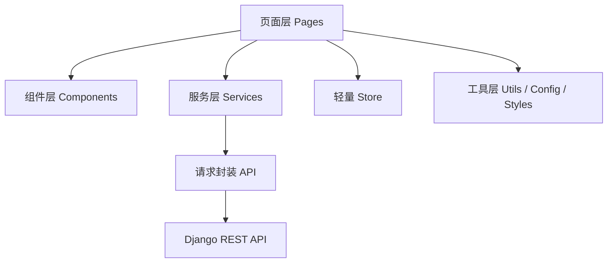

# 英语单词微信小程序小程序架构文档

## 1. 文档说明

- 项目名称：英语单词微信小程序
- 文档名称：项目小程序架构文档
- 文档版本：V1.1
- 编写日期：2026-04-08
- 适用范围：微信小程序前端架构、页面组织、组件设计、接口联调设计

## 2. 架构目标

小程序端需要满足以下目标：

- 使用微信小程序原生框架，基于 WXML + WXSS + JavaScript (ES6) 完成首版开发。
- 完整承接需求文档和高保真原型中的核心页面与交互流程。
- 保证页面结构清晰、复用合理、联调方便、后续维护成本可控。
- 支持“语法”导航入口及句子级语法学习交互，形成单词学习之外的第二条核心学习路径。
- 与后端 Django API 保持清晰的接口边界。

## 3. 技术选型

### 3.1 首版必选技术

- 开发框架：微信小程序原生框架
- 页面描述：WXML
- 页面逻辑：JavaScript (ES6)
- 页面样式：WXSS
- 全局配置：`app.json`
- 页面路由：微信小程序原生路由
- 网络请求：`wx.request` 二次封装

### 3.2 设计实现原则

- 不引入重型前端框架，优先保持原生小程序结构清晰。
- 页面逻辑代码统一采用 JavaScript ES6 语法规范编写。
- 使用原生自定义组件提高 UI 复用率。
- 使用自定义 `tabBar` 对齐当前高保真原型中的底部导航视觉风格。
- 页面状态以“页面局部状态 + 全局轻量 store”组合管理。

## 4. 页面架构设计

根据需求文档与当前设计原型，首版小程序页面如下：

| 页面名称 | 页面目录 | 说明 |
| --- | --- | --- |
| 登录引导页 | `pages/login` | 微信登录、游客预览、品牌引导 |
| 首页 | `pages/home` | 今日任务、进度、快捷入口 |
| 词书选择页 | `pages/books` | 词书浏览、筛选、切换 |
| 语法首页 | `pages/grammar` | 语法功能分块入口页，模块顺序为“语法总览 → 自动拆句 → 例句学语法” |
| 语法总览页 | `pages/grammar-guide` | 轻量目录页，按分册展示学习顺序与入口 |
| 语法分册详情页 | `pages/grammar-guide-volume` | 单册章节、易错点、学习目标等详细内容 |
| 自动拆句页 | `pages/grammar-analyze` | 输入任意英文句子并即时分析 |
| 例句学语法页 | `pages/grammar-examples` | 句库筛选、例句拆解、主干视图、专项练习 |
| 学习计划页 | `pages/plan` | 每日目标设置、提醒时间设置 |
| 单词学习页 | `pages/learn` | 单词卡学习、发音、收藏、认识/不认识、本地/AI 讲词助手 |
| 复习页 | `pages/review` | 多题型复习、即时反馈 |
| 测试页 | `pages/test` | 快速测验、成绩预览 |
| 单词详情页 | `pages/word-detail` | 单词详情、例句、学习轨迹、本地/AI 讲词助手 |
| 错词本页 | `pages/wrong-words` | 错词优先复习、错词管理、AI 错词复盘 |
| 收藏夹页 | `pages/favorites` | 收藏词清单、重点词管理 |
| 统计页 | `pages/stats` | 趋势统计、打卡、掌握分布 |
| 个人中心页 | `pages/profile` | 个人设置、计划入口、开关设置 |
| 意见反馈页 | `pages/feedback` | 用户填写问题、建议或内容纠错，提交后进入后台处理 |

## 5. 小程序总体架构

小程序端采用“页面层 + 组件层 + 服务层 + 数据层 + 工具层”的分层方式。



### 5.1 分层说明

- 页面层：负责页面结构、页面交互、生命周期管理。
- 组件层：沉淀高复用 UI 组件，例如单词卡、任务卡、导航栏、空状态组件。
- 服务层：负责业务接口调用，按业务模块拆分。
- 数据层：负责本地缓存、登录态、当前计划、用户信息、部分页面共享状态。
- 工具层：负责请求封装、格式化、常量配置、公共样式变量。

## 6. 页面与交互设计映射

当前已生成的高保真原型页面与小程序页面一一对应，建议按下列方式落地：

| 原型页面 | 小程序页面目录 | 主要功能 |
| --- | --- | --- |
| `design/login.html` | `pages/login` | 品牌引导、微信登录 |
| `design/home.html` | `pages/home` | 今日任务概览、快捷入口 |
| `design/books.html` | `pages/books` | 词书列表、关键词搜索、分类/难度筛选、切换 |
| `design/grammar.html` | `pages/grammar` | 语法首页与功能入口 |
| `design/plan.html` | `pages/plan` | 每日目标、当前计划、暂停/恢复、切换词书、保留/重置进度 |
| `design/learn.html` | `pages/learn` | 单词学习主链路 |
| `design/review.html` | `pages/review` | 复习题型与答题，包含听音辨词；语速统一读取学习设置 |
| `design/test.html` | `pages/test` | 小测验与结果预览 |
| `design/word-detail.html` | `pages/word-detail` | 单词详情和轨迹 |
| `design/wrong-words.html` | `pages/wrong-words` | 错词管理 |
| `design/favorites.html` | `pages/favorites` | 收藏夹 |
| `design/stats.html` | `pages/stats` | 学习统计 |
| `design/profile.html` | `pages/profile` | 个人中心 |

## 7. 路由与导航设计

## 7.1 tabBar 设计

建议首页、词书、语法、统计、我的使用底部主导航。

tabBar 建议入口：

- 首页
- 词书
- 语法
- 统计
- 我的

为了更贴合高保真设计图，建议采用自定义 `custom-tab-bar`，而不是默认 tabBar 样式。

语法页导航设计建议：

- 使用五栏 tabBar，顺序为“首页 / 词书 / 语法 / 统计 / 我的”。
- “语法”作为主入口时，图标和文案需要与词书入口明显区分，避免用户误以为仍是单词列表。
- 语法页进入后先展示“语法总览 / 自动拆句 / 例句学语法”三个功能块，再由二级页面承接具体学习流程。

## 7.2 非 tabBar 页面

以下页面使用普通跳转：

- 登录页
- 学习计划页
- 单词学习页
- 复习页
- 测试页
- 单词详情页
- 错词本页
- 收藏夹页
- 意见反馈页

## 7.3 跳转方式建议

- 主入口切换：`switchTab`
- 业务页面跳转：`navigateTo`
- 返回上一页：`navigateBack`
- 登录后替换栈顶：按实际流程使用 `reLaunch` 或 `redirectTo`

## 8. 状态管理设计

## 8.1 首版状态管理原则

首版不建议引入复杂状态管理框架，采用以下方案即可：

- 全局数据：保存在 `App` 实例或独立 `store` 模块
- 页面局部状态：保存在页面 `data`
- 本地持久化：使用 `wx.setStorageSync` / `wx.getStorageSync`

## 8.2 建议全局状态项

- 用户 Token
- 用户基础信息
- 当前学习计划
- 当前词书摘要
- 当前语法主题或筛选条件
- 是否已登录

## 8.3 本地缓存建议

- `token`
- `user_info`
- `current_plan`
- `current_book`
- `grammar_filters`
- `grammar_progress`
- `settings`

## 9. 网络请求架构

## 9.1 请求层原则

- 所有请求统一由 `services/api` 进行基础封装。
- 业务接口按模块拆到 `services/modules`。
- 页面不直接写裸 `wx.request`。

## 9.2 建议封装内容

- `baseURL`
- Token 自动注入
- 通用 Header
- 统一错误处理
- 登录态过期处理
- 加载态控制
- 统一响应解包

## 9.3 模块划分建议

| 模块文件 | 说明 |
| --- | --- |
| `services/modules/auth.js` | 登录、用户信息、学习设置、意见反馈 |
| `services/modules/books.js` | 词书和单词查询 |
| `services/modules/plans.js` | 学习计划 |
| `services/modules/learn.js` | 学习记录 |
| `services/modules/review.js` | 复习任务 |
| `services/modules/exams.js` | 测试功能 |
| `services/modules/grammar.js` | 语法主题、句子列表、句子详情、学习记录 |
| `services/modules/stats.js` | 统计与打卡 |
| `services/modules/favorites.js` | 收藏与错词本 |

## 10. 组件架构设计

小程序端应优先沉淀高复用组件。

### 10.1 建议组件

| 组件目录 | 说明 |
| --- | --- |
| `components/nav-bar` | 顶部导航栏、返回、标题、右侧操作 |
| `components/word-card` | 单词学习卡、发音、收藏、词性展示 |
| `components/progress-panel` | 进度环、统计卡、任务概览 |
| `components/book-card` | 词书卡片、简介、标签、切换按钮 |
| `components/sentence-annotation` | 句子颜色标注、点击高亮、片段解释 |
| `components/grammar-legend` | 语法颜色图例、角色说明 |
| `components/grammar-point-card` | 语法点摘要、难度、标签、进入学习 |
| `components/chunk-card` | 长难句分块、主干与修饰结构切换 |
| `components/grammar-practice-sheet` | 成分识别、时态判断、语序重组等练习面板 |
| `components/task-card` | 首页快捷任务卡 |
| `components/empty-state` | 无数据、网络错误、加载失败展示 |

### 10.2 组件设计原则

- 组件只处理展示和基础交互
- 复杂业务请求由页面或 service 层控制
- 公共样式尽量抽到 `styles` 目录

## 11. 页面分层建议

每个页面建议包含以下职责：

### 11.1 页面文件职责

- `.wxml`：页面结构
- `.wxss`：页面样式
- `.js`：页面逻辑、生命周期、事件响应，统一采用 JavaScript ES6 语法
- `.json`：页面配置、导航栏标题、组件注册

### 11.2 页面逻辑边界

- 页面负责组合组件、拉取页面数据、处理跳转
- service 层负责接口调用
- utils 负责格式化和工具函数
- store 负责跨页面状态

## 12. 小程序目录结构设计

说明：

- 以下为建议目录结构，当前项目已创建目录骨架。
- 具体小程序源码文件将在开发阶段继续补齐。

```text
front/
├─ pages/
│  ├─ login/
│  ├─ home/
│  ├─ books/
│  ├─ grammar/
│  ├─ grammar-examples/
│  ├─ grammar-analyze/
│  ├─ grammar-guide/
│  ├─ grammar-guide-volume/
│  ├─ plan/
│  ├─ learn/
│  ├─ review/
│  ├─ test/
│  ├─ word-detail/
│  ├─ wrong-words/
│  ├─ favorites/
│  ├─ stats/
│  └─ profile/
├─ components/
│  ├─ nav-bar/
│  ├─ word-card/
│  ├─ progress-panel/
│  ├─ book-card/
│  ├─ sentence-annotation/
│  ├─ grammar-legend/
│  ├─ grammar-point-card/
│  ├─ chunk-card/
│  ├─ grammar-practice-sheet/
│  ├─ task-card/
│  └─ empty-state/
├─ custom-tab-bar/
├─ services/
│  ├─ api/
│  └─ modules/
├─ store/
├─ utils/
├─ config/
├─ styles/
└─ assets/
   ├─ icons/
   └─ images/
```

## 13. 目录职责说明

### 13.1 `pages`

- 页面级目录
- 一个业务页面一个独立目录
- 便于和需求文档、原型图一一对应
- 语法模块采用“一个 tab 主入口 + 多个二级页面”的结构，降低单页复杂度

### 13.2 `components`

- 存放复用组件
- 控制 UI 复用粒度
- 降低页面重复代码

### 13.3 `custom-tab-bar`

- 自定义底部导航
- 对齐当前设计图中的高保真导航风格

### 13.4 `services`

- 封装接口请求
- 管理按业务域拆分的 API 文件

### 13.5 `store`

- 放全局状态和本地缓存桥接逻辑
- 管理用户登录态、当前计划、当前词书等信息

### 13.6 `styles`

- 放公共样式变量
- 放通用布局、颜色、字体、间距定义

### 13.7 `config`

- 放环境配置
- 例如 `baseURL`、调试开关、版本号等

## 14. 小程序与后端接口边界

## 14.1 小程序负责

- 页面渲染
- 用户交互
- 请求发起
- 本地缓存
- 登录态保存与失效处理
- 语法句子标注的交互展示、主干视图切换和讲解弹层
- AI 功能开关状态展示：AI 讲词和 AI 学习教练均由用户主动开启，默认展示非 AI 基础内容

## 14.2 后端负责

- 用户认证
- 业务规则判定
- 词书与单词数据输出
- 语法主题、句子标注、长难句拆解数据输出
- 学习任务生成
- 掌握度计算
- 测试与统计结果计算
- AI 讲词与 AI 学习教练的数据聚合和模型调用，输入应包含对应单词、用户学习状态、当前计划、已学词、错词和统计趋势

## 14.3 交互原则

- 小程序不做核心业务规则裁决
- 掌握度、复习队列、测试结果等核心逻辑由后端统一计算
- 小程序只负责展示与提交行为结果

## 15. 性能与体验设计建议

### 15.1 性能建议

- 首页接口聚合输出，减少多次请求
- 词书列表、错词本、收藏夹支持分页加载
- 页面按需加载数据，避免一次性请求过大
- 发音、图片等资源按需加载

### 15.2 体验建议

- 使用骨架屏或加载占位优化等待体验
- 使用轻提示反馈请求结果
- 对提交类操作增加防重复点击控制
- 对弱网场景提供重试提示
- 语法页建议支持“逐步显示标注”“点击片段弹出解释”“主干与完整句切换”，降低长难句阅读压力
- AI 面板请求中、超时或后端未配置时，只显示加载或错误状态，不复用本地讲词/本地建议内容，避免来源混淆
- 跟读识别、发音评分相关入口当前版本不展示，待微信后台插件授权完成后再作为独立口语练习能力接入

### 15.3 缓存建议

- 词书列表可短时缓存
- 用户信息和当前计划可本地缓存
- 统计页可按时间维度做短暂缓存
- 语法主题列表和已学习句子进度可做短时缓存，避免频繁重复请求

## 16. 开发规范建议

- 页面名称、目录名称与需求文档保持一致
- 组件命名采用统一前缀或统一风格
- 页面只保留当前页面必要状态
- 所有接口统一走 service 层
- 样式优先抽公共变量，避免页面重复硬编码

## 17. 首版开发顺序建议

P0：

1. 登录页
2. 首页
3. 词书选择页
4. 学习计划页
5. 单词学习页
6. 复习页
7. 统计页
8. 个人中心页

当前 P0 页面补齐状态：

- `pages/books` 已接入词书关键词搜索、考试/阶段筛选、难度层级筛选。
- `pages/plan` 已接入当前计划展示、每日目标调整、暂停/恢复、切换词书时保留或重置进度。
- `pages/settings` 已接入全局发音语速设置，单词、例句、复习听音和语法句子朗读统一读取该设置。
- `pages/review` 已接入听音辨词题型、单词播放入口和提交后的即时答题反馈，语速不在题目页单独设置。
- `pages/learn` 和 `pages/word-detail` 已将“AI 讲词”改为用户主动开启，默认只展示本地讲词；AI 重讲时会清空旧内容，避免本地与 AI 结果混淆。
- `pages/learn` 学习首屏已调整为“两段式决策”：先听发音 / 听例句 / 判断是否认识，不再默认直接展示中文释义；若点“不太熟”才会展开中文释义、例句和本地 / AI 讲词助手，再做最终判断，避免用户一上来先看到答案。
- `pages/home` 已将 AI 学习教练默认关闭，用户主动开启后再请求后端聚合当前计划、已学词、错词和统计趋势。
- `pages/wrong-words` 已接入 AI 错词复盘，用于输出高优先级错词、错误模式和复习动作。
- `pages/ai-center` 已接入 AI 周报/月报、报告历史对比、写作批改、写作题目与范文、翻译训练、RAG 学习问答、轻量向量 RAG、RAG 召回评测、连续追问、情景文本对话任务模板、语法导学、多老师协作简报、AI 运行观测和 AI 反馈入口；页面顶部新增“模块成熟度”面板，用来区分 Agent / RAG / MCP / 应用 / 观测当前是“可用”还是“演示版”；其中 Agent 页优先突出“AI 给出的今日学习计划”，LangGraph 检索编排 Demo 作为高级演示区保留在 Agent 模块下方，计划回滚入口暂不在前端主界面展示。
- `pages/feedback` 已接入意见反馈提交，后台可通过 Django Admin 查看。
- 当前版本已移除跟读识别和发音评分入口，待微信插件授权完成后再实现。

P1：

1. 测试页
2. 单词详情页
3. 错词本页
4. 收藏夹页
5. 语法学习页与句子标注组件
6. 自定义 tabBar 和更多动效细节

## 18. 结论

本项目小程序端建议采用“微信小程序原生框架 + WXML + WXSS + JavaScript (ES6) + 页面与组件分层 + 统一服务层 + 轻量状态管理 + 自定义 tabBar”的实现方案。该方案与当前需求文档和高保真原型高度一致，不仅适合快速进入开发阶段，也便于后续承接语法句子标注、长难句拆解和专项练习等更复杂的学习交互。

## 19. 2026-05 AI 展示能力补充说明

- `pages/ai-center` 已从“AI 功能入口页”升级为“AI / Agent 能力展示页”。
- AI 中心顶部新增“模块成熟度”面板，便于在演示或简历答辩时快速说明 Agent、RAG、MCP、应用、观测分别做到什么程度。
- 页面中可直接展示：
  - 学习计划重规划 Agent
  - 结构化 RAG
  - 向量 RAG
  - RAG 召回评测
  - MCP tools / resources / prompts
  - 多 Agent 简报
  - AI 运行观测
- 新增统一 `ai-evidence` 组件，用于在多个 AI 场景下展示工作流、工具调用、知识命中与延迟/缓存等证据。
- 首页 AI 学习教练、学习页 AI 讲词、单词详情 AI 讲词、错词本 AI 复盘均已接入 evidence 展示。
- AI 中心首页卡片会直接展示 LangGraph / Pipeline、LangChain、RAG、MCP、Evidence 等能力映射，方便项目演示与简历答辩。
